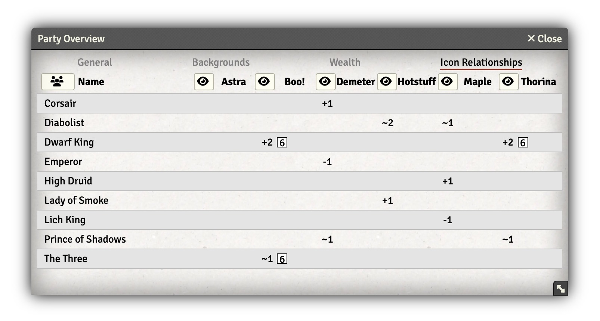
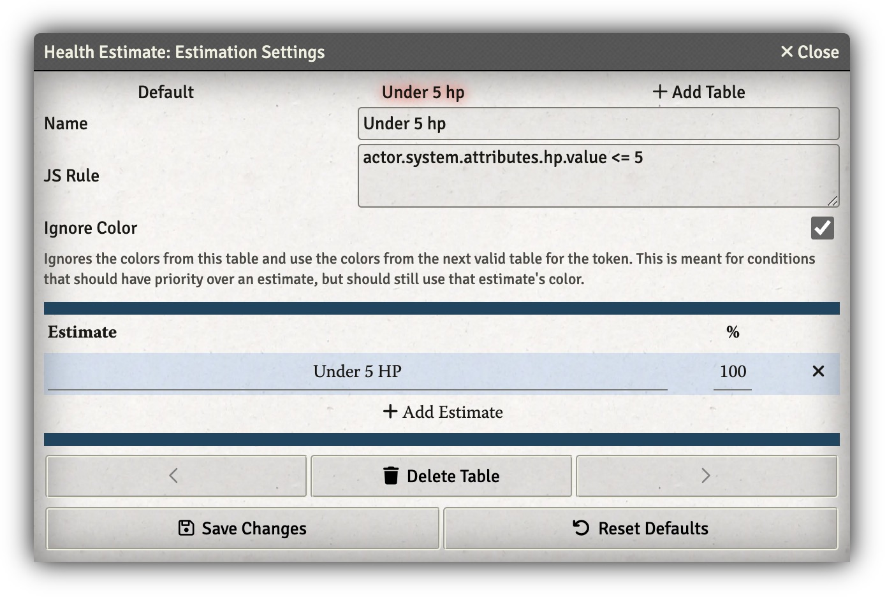
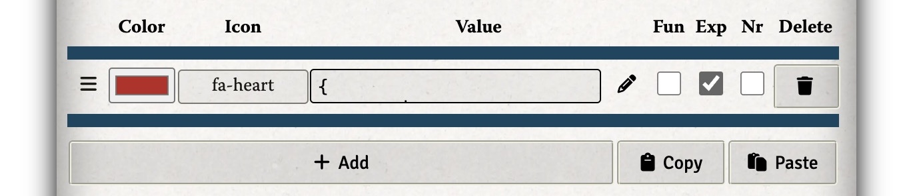
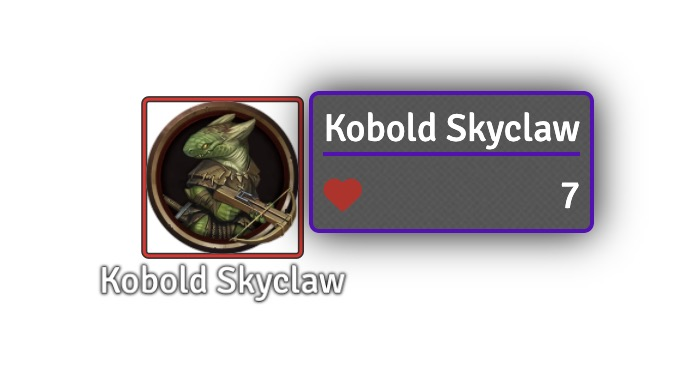
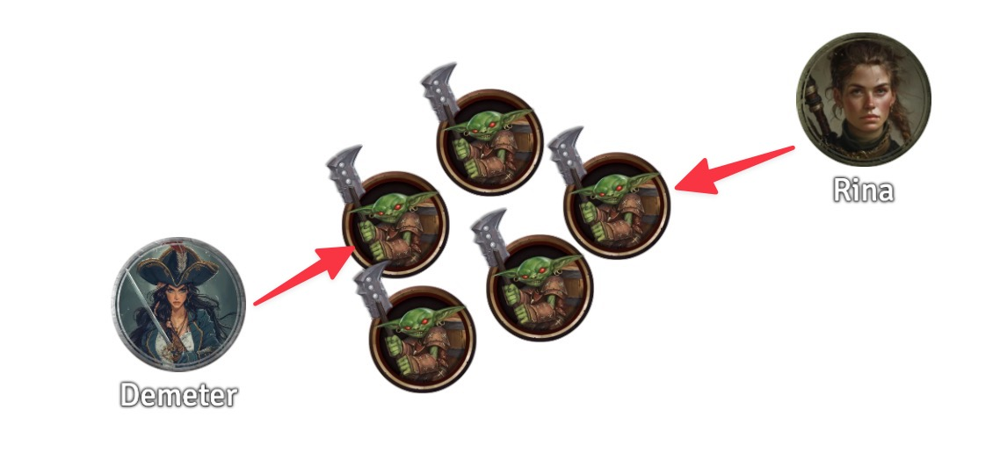
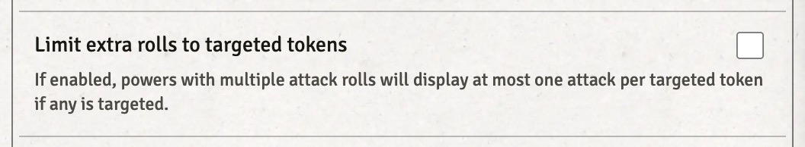
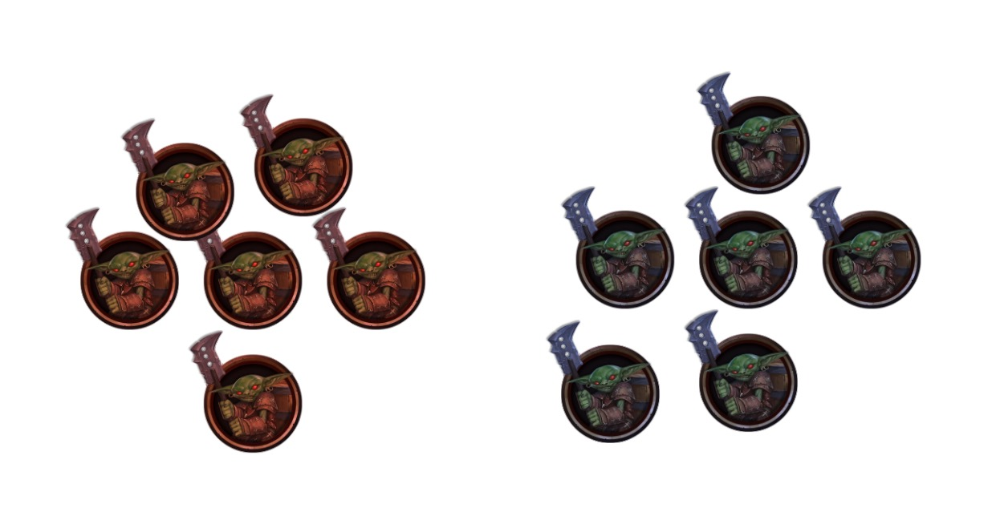

I've been running [13th Age](https://pelgranepress.com/13th-age/) on Foundry for a while now, and I think I've got a reasonable set of recommendations that are battle-tested.
Here they are, so I don't have to keep typing them out.

A note on timing: this is written in mid-2024.
I know that all of these modules and methods work on both Foundry v11 and v12, and they'll probably continue to work for at least a version or two.
But if you're running Foundry v20 or something when you read this, you might have a bad time.

There's a lot of exposition and screenshots here; if you just want the list of modules, [skip to the bottom](#summary).

## Pathfinder Token Pack

First things first: if you want an instant upgrade to your experience, go and buy the [Pathfinder Tokens: Bestiaries](https://paizo.com/products/btq02eat?Pathfinder-Tokens-Bestiaries) product from Paizo.
The 13th Age system detects this when it's installed and active, and will re-map the token and portrait art for SRD monsters to use the fantastic artwork that Paizo has produced.


## Party Overview

One thing 13th Age GMs should always keep in mind is the PCs' icon relationships, and what kind of live benefits are out there.
That's where [Party Overview](https://foundryvtt.com/packages/party-overview) comes in.
In addition to giving you a readout of PC/icon stuff, it also shows thier backgrounds, money, and health and defenses.
Super handy, an easy thing to say yes to.



## Hit Point Thresholds

Several character abilities are limited to "enemies with fewer than N hit points."
In person, the player can just ask the GM which monsters are valid targets, and maybe the GM will even remember to tell them that "oh this orc just got below 5hp."
But when you're on a Zoom call, that's really disruptive and breaks the flow, and this is a place where VTTs can actually do a better job than a physical table, because the system can give the player information without needing to consult the GM at all.

I've got two methods for doing this.
One takes more configuration but is very exact in the amount of information it provides.
The other is configured once and never again, but hands out information that you might think of as being for GMs' eyes only.
They're not exclusive, my table actually uses both of them.

### The Low-Information Way

There's a module called [Health Estimate](https://foundryvtt.com/packages/dice-so-nice), which can add hover-only labels on monsters so the players can see their general condition without knowing their exact hit point total.
It's actually pretty useful out of the box, but we'll be sacrificing that for automated announcements when they cross specific hit point thresholds.

So you're going to find the module settings, and do this:

1. Check the "output estimate to chat" box.
2. Open the "estimation settings."
3. Empty the default table.
4. Add a new table (I called mine "under 5 hp").
5. Set the JS rule to
   ```
	 actor.system.attributes.hp.value <= 5
	 ```
6. Add an estimate row, with the label `Under 5 HP`, and the % set to `100`.



Now it should work: when a monster is below 6 hit points, hovering over it produces a nice helpful label, but more importantly, the chat bar will get an announcement when that happens:


This has the benefit of telling your players only what they need to know to power something like Deathknell, and announcing it at just the right time.
But it does require some manual configuration when someone picks up a new ability that has a new threshold.
And it's also a bit quirky; it re-announces the state whenever that monster takes damage, and **clears it** when they die.


It's a bit wonky, but not hard to ignore, and it doesn't actively hurt anything, so maybe that's acceptable to you.

### The High-Information Way

Just tell them the monsters' hit points.
I know this isn't going to be for everyone, and I thought it might ruin some of the magic at my table, but my players actually seem to like it.

This involves a module called [Token Tooltip Alt](https://foundryvtt.com/packages/token-tooltip-alt).
Open up its config, and open up the Tooltip Manager.
you're going to be adjusting the "default" group.

On the Player tab, add a new row to the "Secret" group.
Check the "Exp" box, set the icon to `fa-heart`, and add this text to the text box:

```
{
	hp=<attributes.hp.value>;
	hpt=<attributes.hp.temp>;
	hpt=compareText(typeOf(hpt), "null") == 0 ? 0 : hpt;
	hpt=(hpt == 0) ? "" : concat(" (+", string(hpt), "t)");
	concat(string(hp), hpt)
}
```

On the GM tab, do the same thing, but use this text instead:

```
{
	hp=<attributes.hp.value>;
	hpm=<attributes.hp.max>;
	hpt=<attributes.hp.temp>;
	hpt=compareText(typeOf(hpt), "null") == 0 ? 0 : hpt;
	hpt=(hpt == 0) ? "" : concat("+", string(hpt));
	concat(string(hp), hpt, "/", string(hpm))
}
```

It should look like this:



Now both you and your players can hover over a monster, you (and they) can see its current hit points, and you'll also see their max hp.



## Mook Mobs

Foundry out of the box isn't really set up to run mobs of mooks the way you'd want to.
In the rules, mooks are described pretty simply: they're in most respects normal creatures, except that a mob of them shares a hit-point pool.
Well, it turns out that simple adjustment breaks a **lot** of Foundry's default assumptions for how creatures work.

To my eyes, there are three main ways to run them, and then a secret fourth way that I use.

### Linked Tokens (The Bad Way)

This is the way PC tokens are configured, as "linked" to their game actors.

Don't do it this way.
It has all the downsides of the methods described below, plus the hassle of creating 12 full actors when you need a mob of 12 mooks.

### Unlinked Tokens (The Foundry Default)

Under this method, you just drag mooks onto the scene, and let Foundry track their hit points.
This works okay, with a couple of exceptions.
One is that your initiative tracker is going to get _very_ crowded.

Another is the way damage is tracked.
In this screenshot, Demeter and Thorina are attacking the same mob of mooks, which start with 7 hp.
They both do 5 damage.
What happens?



13th Age says "one of those mooks is dead, and the mob has 3 damage towards removing another one."
But Foundry shows you having two damaged mooks with 2hp left.
You still get an arithmetic problem every time you remove a mook, and Foundry isn't helping you at all.

### Mob Tokens (The Swarm Method)

With this method, you represent the entire mob of `N` mooks as one **big** token, making adjustments like this:

- Multiply the max and current hit points by `N`
- Every attack is modifed to have a number of attacks, using a formula like this, where `K` is the max hit points of a single mook:
  ```
	[[d20 + 5]] vs. AC ([[ceil(@hp.value/K)]] attacks)
	```
- Adjust the token to be one or two sizes larger

You'll also want to adjust the 13th Age system settings to uncheck this box, so that your mob will roll all of its attacks even if it only has one target:



This has a number of benefits.
Firstly, no more arithmetic problems for you!
The number of attacks will reduce as the mob takes damage.
Second, those abilities that trigger on "an enemy has less than 5hp" usually also trigger on the last mook in a mob, so this integrates well with the [health-estimate-module method](#the-low-info-way) described above.
Thirdly, the mob appears as a single initiative entry, and behaves properly when the mob is cleared.

The major downsides here are that when you want to use a mob, you have to do some manual adjustments to it before you drop it on the map, and that takes time.
This also prevents you from splitting a mob up – they're always going to move as a unit, and there's no way to apply a status effect to just one of them.
Tracking ongoing damage is left as an exercise to the reader.

### My Hybrid Method

I wanted to keep the mooks as individual creatures, but still track their HP as a group.
Well it turns out I still have paper on my desk.
So my hybrid method looks like this:

- Use unlinked tokens, just drag them onto the scene.
- Add a hidden token to the scene, and only add that one to the combat tracker to keep the clutter down.
- Color-code them using the token-appearance "tint" control, so the players (and I) can see which mob they belong to.
- Whip out a sticky note on my desk for each mob, and count up damage. When it crosses the threshold, delete the appropriate number of tokens from the scene.



It's low-tech, but it works.
It's really easy to adjust numbers by just dropping or deleting tokens.
The players don't get full visibility of the mob's hit point status, but they *can* see the mooks disappearing, which is usually enough.
The arithmetic is no harder than it was before, and I do less fiddling with Foundry.
The mooks get to be their own creatures for things like confusion effects and ongoing damage, but still share their hit points.

This is the best balace I've found for myself, but obviously you might prefer one of the other options.

## Random Choices

There are a few PC abilities that have you choose "a random nearby ally" or something like that.
There's a module called "Roll of Fate" that can help with this, but if you have 12 Bone Imp Mage-Eaters on the board with the same token name, it only outputs the name of the token, which is barely helpful at all.
Now, if you've got Foundry configured to uniquify token names when you drop them, that might be enough.

But if not, I've got a macro for you.
Here's the text of it:

```js
const tokens = canvas.tokens.controlled
const roll = Roll.create(`1d${tokens.length}`)
await roll.roll()
const choice = tokens[roll.total-1]

// Ping on canvas
canvas.ping(choice.center, {duration: 3000})

// Send choice to chat
const content = `
<div class="dice-tooltip">
	<div class="dice-rolls">
		<span class="roll d${tokens.length}">${roll.total}</span>
		means me!
	</div>
</div>`.trim()
ChatMessage.create({
	speaker: game.archmage.ArchmageUtility.getSpeaker(choice.actor),
	content,
	roll,
	rolls: [roll],
	type: CONST.CHAT_MESSAGE_TYPES.ROLL
})
```

To use it, just select all the eligible targets on the map, and run this macro from your hotbar.
It uses Foundry's dice system to choose one of them, pings them on the map, and emits a chat message identifying them in case you missed the ping.
If you have the [Chat Portraits](https://foundryvtt.com/packages/chat-portrait) module installed, you can then double-click on the chat message to select the target that was chosen.


## Damage Logging

It doesn't happen super often, but occasionally I'll go to apply damage to a PC, and the player will also apply that damage.
Or someone will remember that they do miss damage, and we'll have to remember whether we applied it or not.
The [Damage Log](https://foundryvtt.com/packages/damage-log) module can help with this.

Configuration on this one is a matter of taste, but personally I think it's important to uncheck the "use separate damage log tab" setting.
If you do, the damage messages show up in series with the attacks they're related to, giving you a sense of the timeline.
If it's sequestered in its own tab, you might have no idea where this instance of 5 damage came from.


## Shared pointers

Foundry comes with shared pointer locations built-in, but my group found them distracting because you couldn't turn them off.
I found the [Pointer and Pings](https://foundryvtt.com/packages/pointer) module a while ago, and it lets you have your pointer hidden most of the time, and hold down the `X` key to show it to everyone in a much more prominent way.
This also lets the GM control the players' framing of the view when they need to, which is nice.

## Quick search

I've had one of these utilities on my laptop since I can remember, so one of the firtst modules I installed when I bought Foundry was the [Quick Insert Search Widget](https://foundryvtt.com/packages/quick-insert).
Hit `ctrl+space`, type part of a name, and it'll give you a list of matches from your monsters, scenes, journal entries, roll tables, and everything else.
You can even drag actors onto the scene from here, really great for building encounters or switching scenes.


## Other Modules That I Like And You Might Also Like

- [Dice So Nice](https://foundryvtt.com/packages/dice-so-nice) gives you 3D math rocks. Just go get it, and all the dice modules you can find. This one should just come with Foundry.
- [Dice Tray](https://foundryvtt.com/packages/dice-calculator) gives you a clickable dice roller in the chat tab.
- [Carousel Combat Tracker](https://foundryvtt.com/packages/combat-tracker-dock) provides a really nice UI for displaying combat order, status effects, and hit points of everyone in the combat.
- [13th Age Combat Loops](https://foundryvtt.com/packages/13th-age-combat-loops) can auto-advance a playlist based on the value of the escalation die. This is designed to work with the [official 13th Age soundtrack](https://pelgranepress.com/product/13th-age-soundtrack/), which has loops for ED 0-6.
- [Background Scaler](https://foundryvtt.com/packages/background-scaler) gives you a quick way to get the scale of a map right without guessing at numbers. Useful whether or not you use Foundry's grid.
- [Global Progress Clocks](https://foundryvtt.com/packages/global-progress-clocks) is great for things like the Stone Thief "submergence die", or any kind of danger or goal that you want to show to your players.
- [Permission Viewer](https://foundryvtt.com/packages/permission_viewer) shows you in the sidebar which items your players can see.
- [Zoom/Pan Options](https://foundryvtt.com/packages/zoom-pan-options) is a must-have if you're on a laptop with a good trackpad. Scrolling gets smoother, and zooming using the expected gestures becomes possible.

## Summary

If you just want to find and install these without having to parse through my explanations, here's the list:

- [Dice So Nice](https://foundryvtt.com/packages/dice-so-nice)
- [Pathfinder Tokens: Bestiaries](https://paizo.com/products/btq02eat?Pathfinder-Tokens-Bestiaries)
- [Party Overview](https://foundryvtt.com/packages/party-overview)
- [Health Estimate](https://foundryvtt.com/packages/dice-so-nice)
- [Token Tooltip Alt](https://foundryvtt.com/packages/token-tooltip-alt)
- [Chat Portraits](https://foundryvtt.com/packages/chat-portrait)
- [Damage Log](https://foundryvtt.com/packages/damage-log)
- [Pointer and Pings](https://foundryvtt.com/packages/pointer)
- [Quick Insert Search Widget](https://foundryvtt.com/packages/quick-insert)
- [Dice Tray](https://foundryvtt.com/packages/dice-calculator)
- [13th Age Combat Loops](https://foundryvtt.com/packages/13th-age-combat-loops)
- [Background Scaler](https://foundryvtt.com/packages/background-scaler)
- [Global Progress Clocks](https://foundryvtt.com/packages/global-progress-clocks)
- [Permission Viewer](https://foundryvtt.com/packages/permission_viewer)
- [Zoom/Pan Options](https://foundryvtt.com/packages/zoom-pan-options)
