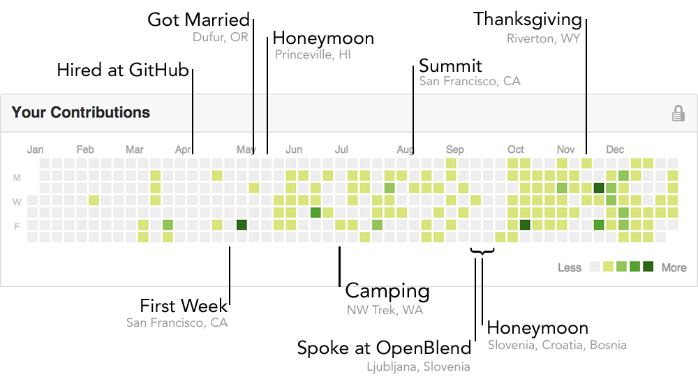

My 2012, through the GitHub lens. Inspired by [Tim Clem](https://github.com/blog/1360-introducing-contributions).

I guess it's not that surprising, but vacations, travel, and holidays show up pretty clearly.

Yes, there are two honeymoons.
Both of them piggybacked on business travel — the first was a [destination wedding](http://www.beckyjenson.com/2012/06/hawaiian-simplicity/) I photographed with my lovely wife a week after we were married, and the second was glued to a [conference](http://www.openblend.org/en/home) I [spoke at](/talks/openblend.html).
