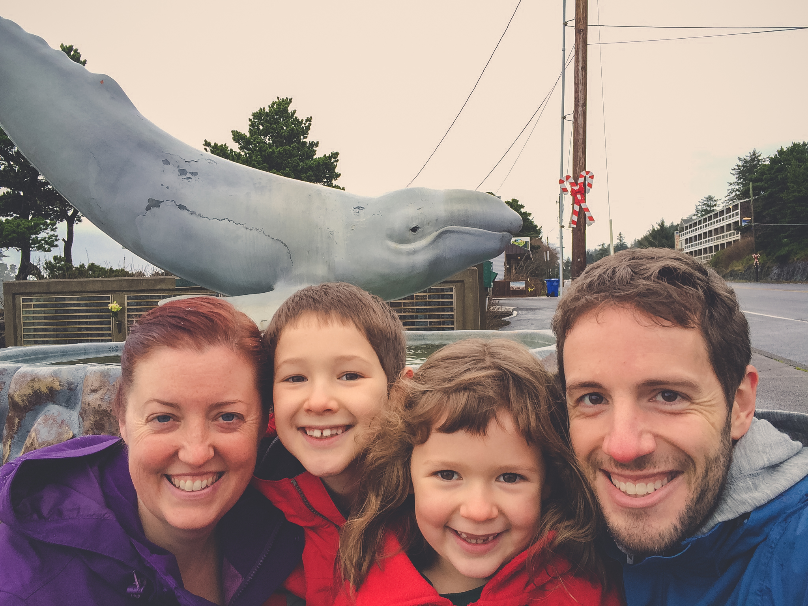
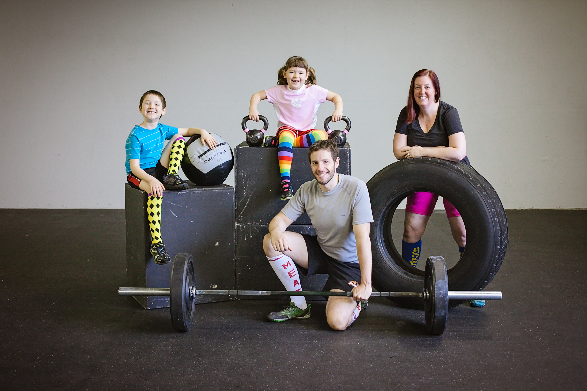
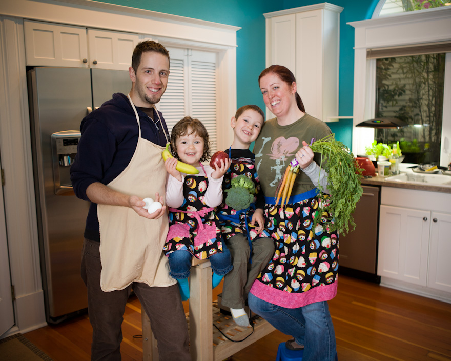
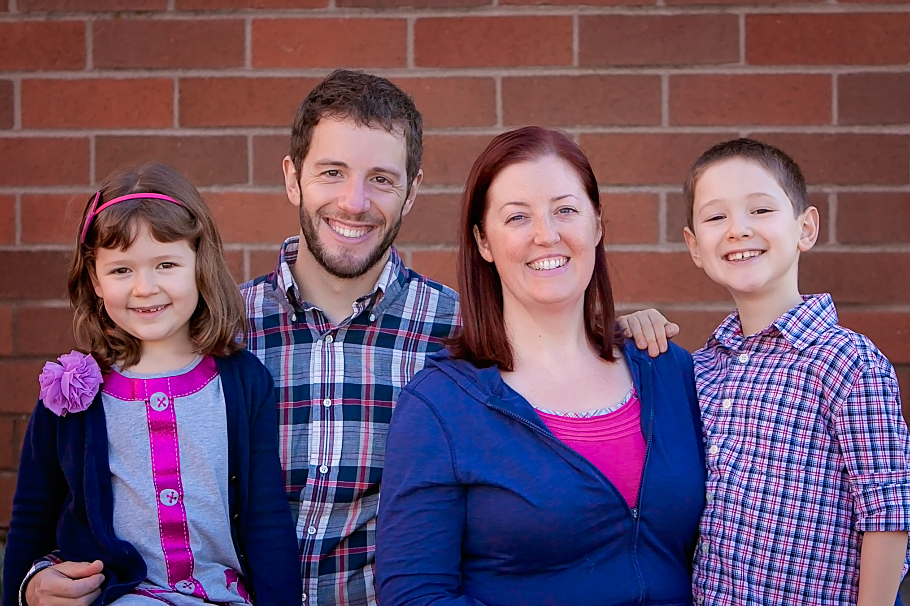

# Adventure as a Family Tradition

One of the most common traits of happy families is having traditions.
Some families recite poetry over dinner; some garden; some collect things.
Our family goes on adventures.

If there's one thing we've learned from being parents, it's that adventures come in all sizes.
On one end of the continuum are life's grand adventures.
Driving an RV [halfway across the country](https://bandofcharacters.wordpress.com/2013/01/09/straubsgiving-part-1/) for Thanksgiving.
[Disneyland](https://bandofcharacters.wordpress.com/2013/09/21/disneyland/).
[Hawaii](https://bandofcharacters.wordpress.com/2013/09/21/hawaii/).
These memorable experiences are the kind of thing you keep with you for a lifetime, and there's nothing that can really substitute for them.

On the other end of the spectrum are tiny adventures.
Reading a great book.
Exploring a different park.
Playing a new family board game for the first time.
Going to the farmer's market.
This kind of adventure isn't as memorable, at least not on its own, but in sum total these little moments — and the way you attack them — add up to a large fraction of your life.

## Capability

It's harder go on adventures (or even want to) with a couch-potato body.
Right now, the kids have zero problems with this; they love to run, jump, and physically exert themselves.
But it's important to practice being active and having fitness goals, so they won't lose that if they get office jobs as grownups.

We couldn't be happier with [Intrepid Athletics][intrepid], the gym right around the corner from our house.
We grownups run our metcons there, but we also send the kids for young adventurer preparedness training.
Also in this category is [Trackers Earth][trackers], an outdoor school which the kids *adore.*
Every Thursday we send them out to the woods at 9am, and every Thursday at 5pm they come back filthy, exhausted, and proud of what they've done – making fires and shelters, using a knife, and tracking coyotes through the woods.
[Mark Sisson][mda] recently wrote about how important this kind of education is.

## Questing

Some of our adventures stand alone, while others are part of a *Quest*.
A Quest is an adventure made of other adventures; it's a commitment to do a bunch of interesting things.
We figure it's one thing to show the kids that we like adventures, it's another to show them how to plan them intentionally.

To that end, we have two Quests going at any given time.
The first one happens yearly, and we call it the [Hundred Things][100].
It's a list of (you guessed it) a hundred goals we have for the year.
Most of these are little things, some are things we had planned anyway, but quite a few are things we never would have done otherwise.

Our long-term Quest is to visit [every Oregon state park][parks] before Will moves out at age 18.
We've given ourselves 10 years to visit 193 parks, waysides, campgrounds, and scenic highways.
This isn't climbing a mountain with our bare hands, but it's great practice so we'll be ready to if (when) we decide to.
We've visited 32 so far, and the joy of exploring our gorgeous state is just as much motivation as the Questing itself.

## Adventure Fuel

It all comes back to food, perhaps the smallest adventure of all.
If you're not willing to try that weird thing on your plate, how will you tackle life's bigger challenges?

Will and Lucy are as engaged in culinary adventures as they are in all the other kinds.
They love helping choose ingredients, perusing our cookbook shelf for the perfect meal, and tying on an apron to help put it together.
(We feel we should mention that one of their favorites when we first started this was [Eat Like a Dinosaur][elad].)
Lucy has been known to trade some of her precious few screen time minutes for more time helping in the kitchen.
One of our [Hundred Things][100] this year is to work our way through an [entire cookbook][zb], and we're all enjoying this challenge.

The Paleo lifestyle has been good to us, and we never feel like we're just too hungry to go out and live life, but it's important to pay attention to the quality of your food.
We're lucky; the Portland, Oregon area is one of the richest when it comes to Paleo- and Primal-style farming and ranching.
Businesses like [Hood River Organics][hro] and [Sweet Home Meats][shm] provide us regularly with boxes of goodies, and we have [The Cultured Caveman][cave] (a fully Paleo restaurant and food carts!) for the occasional meal out.
We've also been lucky enough to secure a supply of raw dairy (which doesn't trigger the kids' immune response like pasteurized dairy does); if you can find something like [Abby Farms][abby] near where you live, don't pass up the opportunity.

## Adventures Aren't Always Comfortable

Our job as parents is to train our children in the fine art of adventuring, and that means dealing with hardship.

Will doesn't like getting wet.
He'll ask someone else to open his car door on rainy days so his hands stay dry.
But when he packs for outdoor school in the dead of winter, he just grits his teeth and packs his rain gear.
And eight hours later, he's sodden and exhilarated, not caring that he got wet.

Lucy doesn't like squash.
She never has, but she knows how good it is for her.
We feed our family *real food*, and that means regional and seasonal produce.
Talking about nutrition and seasonality with the kids is second nature now, so she knows she's going to see it on the table a lot during the winter.
When it shows up on her plate, she makes sure to take little bites of it all throughout dinner, so she doesn't end up with six giant, hateful bites of it at the end.

Because we've taught them that **fun and misery aren't opposites.**
In fact, some of the best moments are the ones you'd think are the worst possible.
You may not recognize them until years later, but they'll be there, because discomfort is memorable.

## Our Family Tradition

We've made a commitment, all four of us, to doing what it takes to make this life worthwhile.
And so not only do we relish the adventures we plan, meticulously,  [100][100] or [200][parks] at a time, but we also keep a careful eye out for journeys we didn't know we were on until we had taken the first step.

Our advice to anyone who asks is this: start thinking of parts of your own life as adventures.
Remember: adventures come in all sizes, from trying a new recipe to traveling around the world.
We think you'll find that your life seems more cinematic and compelling when you look at it through the lens of the explorer.

*(bio snippet here)*

[trackers]: http://trackerspdx.com/
[intrepid]: http://www.intrepidpdx.com/
[hro]: http://hoodriverorganic.csaware.com/
[shm]: http://www.sweethomefarms.com/
[cave]: http://culturedcavemanpdx.com/
[abby]: https://www.facebook.com/abbeyfarmstead
[100]: http://100.straub.cc/
[parks]: https://bandofcharacters.wordpress.com/2014/01/13/oregon-state-park-challenge/
[zb]: http://zenbellycatering.com/zenbelly-cookbook/
[elad]: http://paleoparents.com/eat-like-a-dinosaur/
[mda]: http://www.marksdailyapple.com/are-we-thwarting-childrens-instinct-to-explore/#axzz3UqmreXYR
